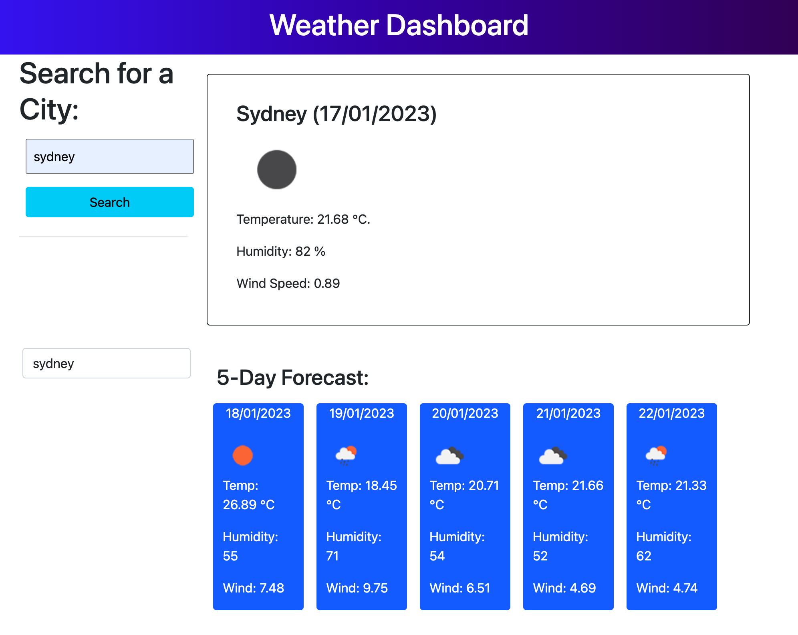

# Weather Dashboard

This weeks challenge, we are to create a web application from scratch building a Weather app . By sending queries to a URL with key parameters, third-party APIs enable me as developer to access the APIs data and functionality. The issue of obtaining data from the API of one application and using it in the context of another is one that developers frequently face. The challenge is to create a weather dashboard with dynamically updated HTML and CSS that runs in the browser.

To display the current weather and forecast for the next five days, enter your city of choice and click search. In order to make it simple to access and re-search weather and predictions, previous searches are saved in local storage and are available as buttons.

## Sreenshot

### Deployment Link

https://joanavillajuan.github.io/weather-dashboard/
